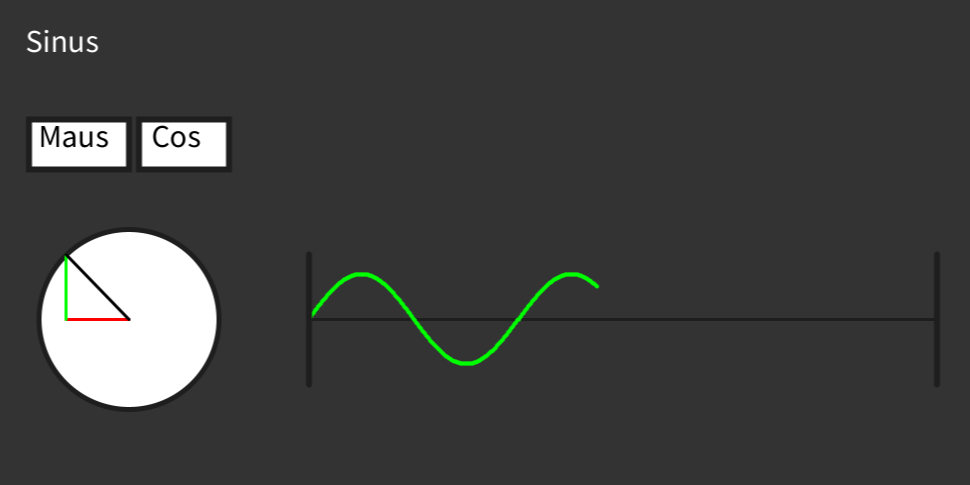
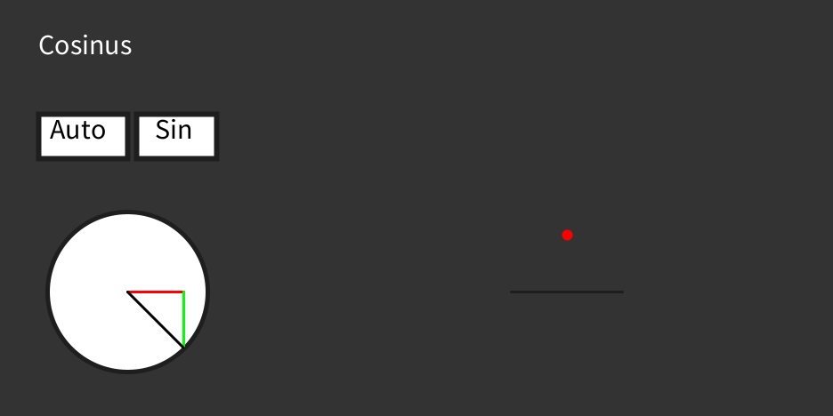

## Description
Visualize sine and cosine, pressing "Maus" or "Auto" will switch between "auto" and "manual"/"mouse" mode. Pressing "Sin" or "Cos" will switch what is displayed on the right (sine/cosine).
The triangle on the left shows the values of sine and cosine in a unit circle.

## Usage
1. Download Processing: https://processing.org/download
2. Run [sinecosine.pde](https://github.com/Timothy248/co-sine/blob/main/sinecosine.pde)

## Screenshots

